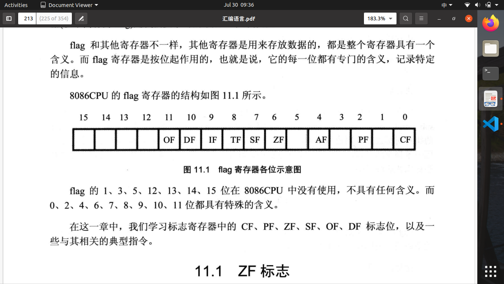
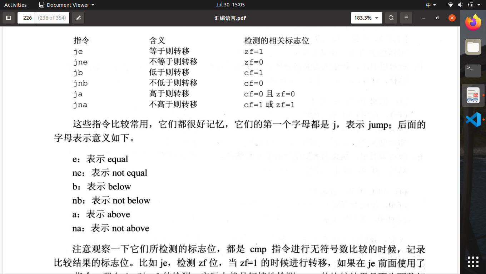
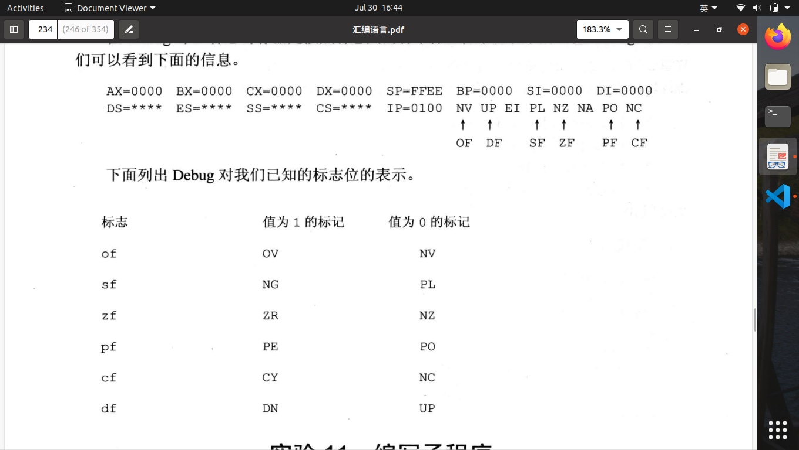

# 第十一章 标志寄存器

1.标志寄存器的作用：用来存储相关指令的某些执行结果；用来为CPU执行相关指令提供行为依据；用来控制CPU的相关工作方式。
2.8086CPU标志寄存器16位，其中存储的信息通常被称作位程序状态字（PSW）。flag寄存器按位其作用，每一位都有专门的含义，记录特定的信息。

3.ZF(zero flag)为第6位，零标志位，记录相关指令执行后，其结果是否为0。ZF=1，结果为0；ZF=0，结果不为0。ZF受运算指令影响。
4.PF(parity flag)为第2位，奇偶标志位，记录相关指令执行后，其结果的所有bit中1的个数是否为偶数。PF=1，个数为偶数；PF=0，个数非偶数。
5.SF(signal flag)为第7位，符号标志位，记录相关指令执行后，其结果是否位负。SF=1，结果为负；SF=0，结果非负。
6.CF(carry flag)为第0位，进位标志位，一般指**无符号数运算**，记录运算结果的最高有效位向更高位的进位值或从更高位的借位值。CF=1，标志有进位或者有借位；CF=0，无进位。
7.OF(overflow flag),一般指**有符号数运算**,记录运算结果是否超出机器所能表达的范围。OF=1，发生溢出；OF=0，没有溢出。
8.adc指令是**带进位加法指令**,利用了CF位上记录的进位值。格式：adc 操作对象1，操作对象2;功能：操作对象1=操作对象1+操作对象2+CF。(ax)=(ax)(bx)+CF
9.sub和add指令并不直接加入CF进行计算，但是有进位或借位。
10.执行adc指令时候加上的CF的值的含义，是由adc指令前面的指令决定的。sub就是借位，add就是进位。
11.加法可分为两步进行：低位相加；高位相加再加上进位值。如：add al,bl;adc ah,bh
12.sbb指令是**带借位减法指令**，格式：sbb 操作对象1，操作对象2，功能：操作对象1=操作对象1-操作对象2-CF。
13.cmp指令是比较指令，功能相当于减法指令，指示不保存结果。格式：cmp 操作对象1-操作对象2；cmp能进行有符号和无符号运算。cmp将指令结果记录在flag的相关标志位中，但不能单从sf值判断逻辑结果的正负。这是因为运算可能发生溢出。溢出导致结果为正，则逻辑结果为负；溢出结果导致为负，则逻辑结果为负。
14.转移指令一览图：

15.DF是第10位，方向标志位。在串处理指令中，控制每次操作后si，di的增减。DF=0，si,di递增；DF=1,si,di递减。
16.movsb串传送指令传送一个字节，格式：movsb；功能分两步：mov es:[di],byte ptr ds:[si];如果df=0，则inc si,di;如果df=1,则递减。
17.movsw传送一个字，格式：movse；功能分两步:mov es:[di],word ptr ds:[si];如果df=0,则add si,2 add di,2;如果df=1，则sub si,2 sub di,2
18.一般movsb和movsw都与rep配合使用 rep movsb相当于:  s:movsb loop s；由此可见rep的作用是根据CX的值，重复执行后面的串行命令。cld设置df=0，std设置df=1。
19.pushf和popf指令功能是将标志寄存器的值压栈或出栈。
20.标志寄存器在Debug的表示为如下图：

21.DF（Direction Flag）:DF=1，方向递减；DF=0，正向递增。
