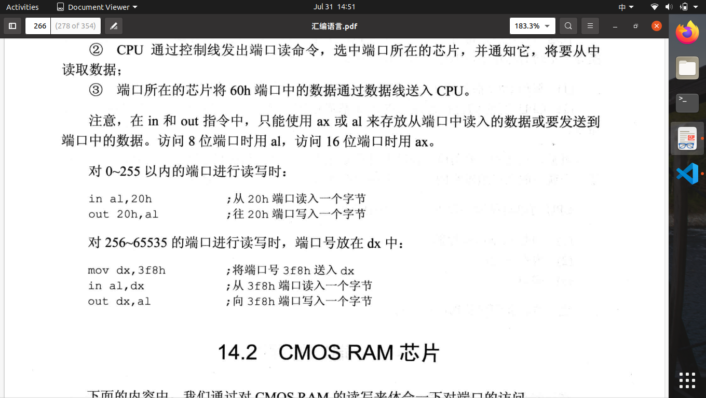

# 第十四章 端口

1.除了内存储器还有IO设备，可统一编址。
2.CPU可直接读写三个地方的数据：CPU内部的寄存器；内存单元；端口
3.CPU最多可定位64KB个不同的端口,端口地址范围为:0~65535
4.对端口的读写不能使mov、push、pop等内存读写指令端口的读写指令,只能使用in或out,分别用于从端口读取数据和往端口写入数据
5.访问内存的步骤：%123%

> **mov ax,ds:[8]访问步骤:**
> 1.CPU通过地址线将地址信息8发出；
> 2.CPU通过控制线发出内存读命令，选中存储器芯片，并通知它，将要从中读取数据；
> 3.存储器将8号单元中的数据通过数据线送入CPU。

6.访问端口的步骤：

> **in al,60h** <!--60端口取出一个字节-->
> 1.CPU通过地址线将地址信息60h发出；
> 2.CPU通过控制线发出端口读命令，选中端口所在的芯片，并通知它，将要从中读取数据；
> 3.端口所在芯片将60h端口中的数据通过数据线送入CPU。

7.端口读写问题：

8.CMOS RAM 地址端口70h，数据端口71h
9.shl shr逻辑移位指令，补0
10.BCD码以4位二进制数表示十进制数字。
