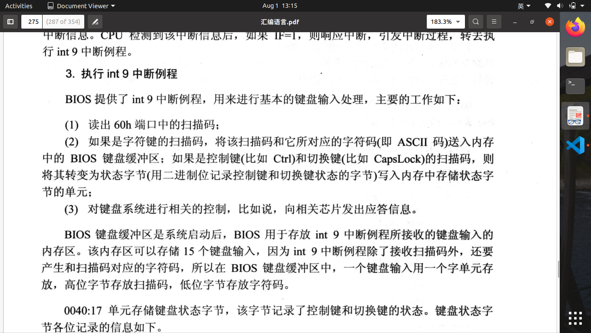

# 第15章 外中断

1.外设接口芯片与许多寄存器,CPU将这些寄存器当作端口访问。
2.外中断一共有两类：可屏蔽中断,由IF控制：IF=0,不响应可屏蔽中断；IF=1，执行完当前指令后，引发中断；不可屏蔽中断，对于8086CPU,不可屏蔽中断中断类型码位2，不可屏蔽中断不需要取中断类型码。由外设引发的中断一般位可屏蔽中断。
3.键盘输入：按下一个键产生的扫描码为通码，松开一个键产生的扫描码为断码。断码=通码+80h

4.六大类指令：数据传送指令，算术运算指令， 逻辑指令，转移指令，处理机控制指令，串处理指令。
