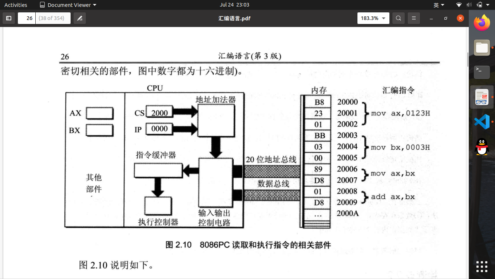

# 第二章 寄存器

1.cpu内部总线，连接运算器，控制器，寄存器等。

> 1.运算器：信息处理
> 2.控制器：控制各器件工作
> 3.寄存器：信息存储

2.8086CPU 16位寄存器可分为两个8位寄存器
3.写一个汇编指令或一个寄存器的时不区分大小写。如：mov ax,18和MOV AX,18
4.进行数据传送或运算时，指令操作对象的位数应当一致。
5.8086：16位CPU一次性只能处理，传输，暂时存储16位地址
6.8086在内部用俩个16位地址经过地址加法器合成一个20位地址
7.8086物理地址=段地址$\times 16 +$段偏移地址
8.8086有四个通用寄存器:AX,BX,CX,DX；四个段寄存器：CS,DS,SS,ES,段寄存器提供段地址。
9.8086$IP$为**指令地址寄存器**，任意时刻，设CS中内容为$M$，IP中内容为$N$，8086CPU将从内存$M \times 16 + N$单元开始，读取一条指令并执行。

    

10.8086CPU工作过程可描述为：

> 1.从CS:IP指向的内存单元读取指令，并读入指令缓冲器；
> 2.$IP=IP+$所读取指令的长度，指向下一条指令；
> 3.执行指令，仿佛此步骤

11.mov指令称为传送指令，可更改大部分寄存器的值，但无法更改**CS、IP**的值。
12.jmp指令：**“jmp段地址：偏移地址”**，例子**jmp 2AE3:3**：**CS=2AE3H,IP=0003H**;**jmp 某一合法器**功能为：用寄存器中的值修改IP。
13.Debug:

> Debug:
> 1.R：查看寄存器内容，rcs:修改CS寄存器
> 2.D：查看特定地址单元内容
> 3.E：修改特质地址单元内容
> 4.U：将特定地址单元内容显示为汇编指令
> 5.A：直接从CS：IP写入汇编指令

14.perfect ending
