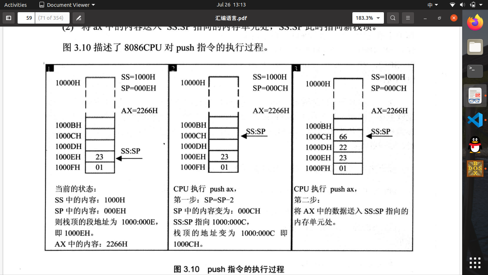
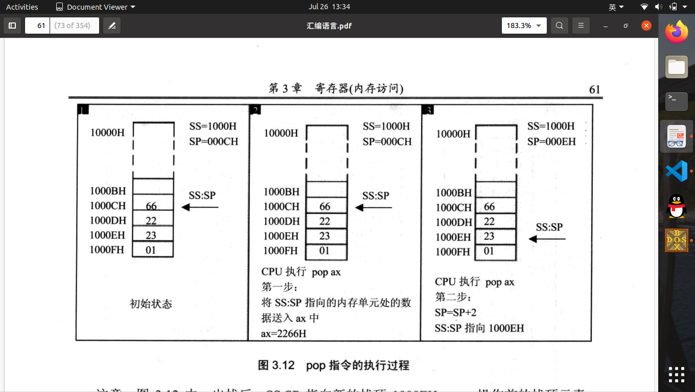

# 寄存器（内存访问）

1.字单元：存放一个字型数据的内存单元。起始地址为N的字单元，称为N地址字单元。
2.DS寄存器：通常存放要访问数据的内存单元段地址。
3.mov 寄存器名，内存单元地址   内存单元地址：[...]表示一个内存单元，[0]表示内存单元的偏移地址。
4.指令执行时，遇到[0]会自动从DS中取出段地址，根据段地址加偏移地址取出一个字长的数据
5.8086CPU不支持将数据传入DS段寄存器，只支持通过一般寄存器中转传入$DS$：
$$mov\nobreakspace bx,1000 \\
mov \nobreakspace DS,bx$$
6.段地址寄存器无法直接参与ADD指令运算。
7.栈（LISO）是一种特殊的访问方式的存储空间。
8.8086CPU提供PUSH和POP操作
9.利用段寄存器SS和寄存器SP形成SS：SP指向栈顶元素，push和pop从SS和SP得到栈顶的地址。入栈从高地址向低地址增长。

> **push:**
> 1.$SP=SP-2$,指向当前栈顶前面的元素，将其作为新栈顶；
> 2.将AX的内容送入SS：SP指向的内存单元处。

    

10.pop后，单元内容依然存在，但是不在栈中。再次执行push指令后单元内容将被覆盖。

> **pop:**
> 1.将SS:SP指向的内容取出到AX中；
> 2.进行$SP=SP+2$指向新元素，新栈顶。

    

11.8086CPU不处理栈顶超界问题，需用户避免超界操作。
12.push和pop可在寄存器和内存之间传送数据，实质上是一种内存传送机制。
13.内存中可分为“数据段”、“代码段”、“栈段”,三者可共用。

> **内存:**
> 1.数据段：DS：[0]
> 2.代码段：CS：IP
> 3.栈段：SS：SP

14.D命令使用的是ds
15.使用t执行命令：mov ss,ax和mov sp,10，两条指令会连续执行。结论：修改SS寄存器都会连续执行修改SP。
