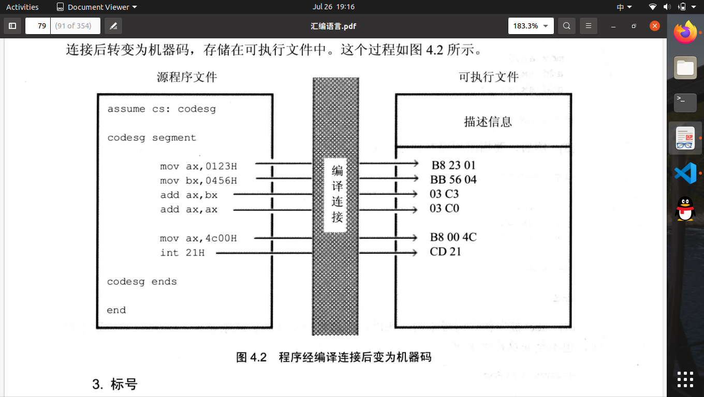
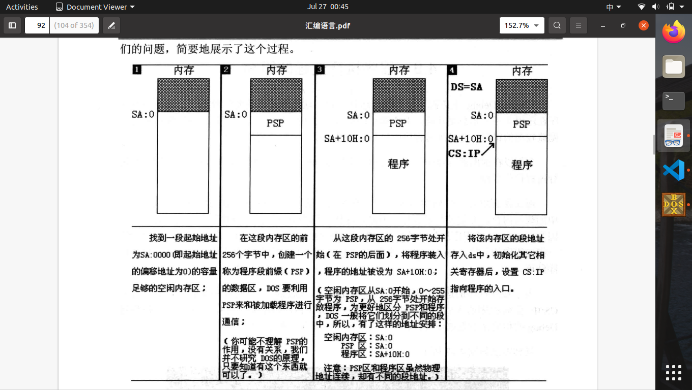

# 第四章 第一个程序

1.伪指令：没有对应机器码的指令，不被CPU执行
2.汇编指令：有对应的机器码的指令，CPU执行
3.**[segment:ends]**：**segment**和**ends**是一对成对使用的伪指令，功能是定义一个段，**segments**开始，**ends**结束。

> **格式:**
> 段名 segment
> :
> 段名 ends

4.**end**:汇编指令的结束伪指令。标记整个程序的技术。
5.**assume**:假设某一段寄存器和程序中的某一个用segment...ends定义的段相连。
6.将源程序所有内容称为**源程序**，将源程序中最终由计算机执行、处理的指令和数据称为**程序**。
7.程序最先以汇编指令存在于源程序中，经过编译、连接后转变位机器码，存储在可执行文件中。

    

8."codesag"称为一个标号，指代一个地址。
9.程序返回，P1执行P2，再返回给P1。
10.程序返回指令：mov ax,4c00H int 21H
11.运行时发生的错误称为**逻辑错误**
12.汇编编译器MASM（微软），汇编后生.obj文件。
13.I：源程序文件 P：编译程序 O：目标文件（.obj），列表文件（.lst），交叉引用文件（.crf）
14.I：目标文件（.obj可以不是obj扩展名，可以为.bin） P：Overlay Linker3.60连接器 O：可执行文件（.exe）途中可生成一个映射文件（.map)
15.即使只有一个源目标文件，也要对其进行连接处理，去掉多余信息，生成可执行文件。
16.通用软件系统都提供一个称为shell(外壳)的程序。DOS的外壳为CMD。
17.可执行文件经过加载（CMD）->内存中程序->运行（CPU）。

    

18.程序装入内存前256字节的PSP(程序段前缀)
