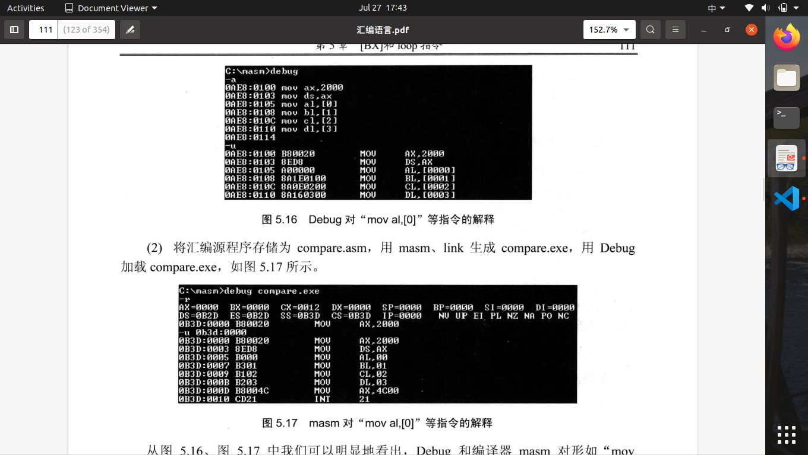

# 第五章 [BX]和loop指令

1.[BX]表示一个内存单元，段地址DS，BX偏移地址。
2.指定一个描述性符号“（）”，例子：（20000H）：20000H单元的内容。
3.“（）”支持<1>寄存器<2>段寄存器<3>内存单元物理地址。表示的数据有两种类型<1>字节型<2>字型
4.(al)字节型(ax)字型
5.约定idata表示常量。mov ax,idata 等同于 mov ax,1(任意常数)
6.mov ax,[bx] 等价于 (ax)=((ds)*16+(bx))
7.inc bx即是给bx加一
8.loop指令:loop标号，CX存放循环次数。

> **loop执行过程:**
> 1.$(cx)=(cx)-1$
> 2.判断$cx$中的值，不为0则转至标号处执行。

<pre style="color:black">
    <code>
     &lt;loop&gt;
     mov cx,循环次数
   s:
     循环执行的程序段
     loop s
    </code>
</pre>

9.标号就代表一个地址。
10.汇编源程序中，数据不能以字母开头，比如fff0h前需要加一个0
11.int21 命令需要用**p**执行
12.g 0012 命令，执行程序到地址0012H处。
13.执行到loop时，使用**p命令**执行循环。当然**g命令**也有此效果

14.masm将[idata]解释为idata,debug将[idata]解释为[idata]
15.masm访问内存单元方式,<1>借用寄存器访问[ax],<2>加段寄存器指明访问：**ds:[idata]**：mov ax,ds:[0]
16.数据相加必须满足运算对象类型匹配以及结果不超界，可借由中介寄存器实现相加。
17.借助寄存器实现变量循环。
18.mov ax,ds:[bx] 形如"ds:"称为段前缀
19.随意向一段空间输入数据是危险的，限定一块安全区**0:200~0:2ff**
18.如何定位mov ax,4c00h之前所有指令
