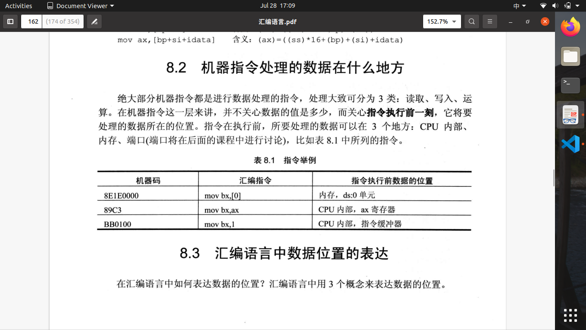
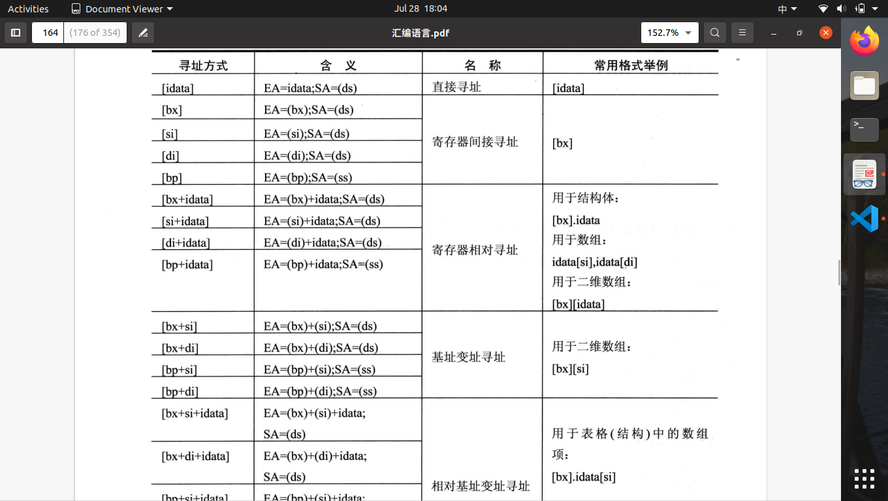
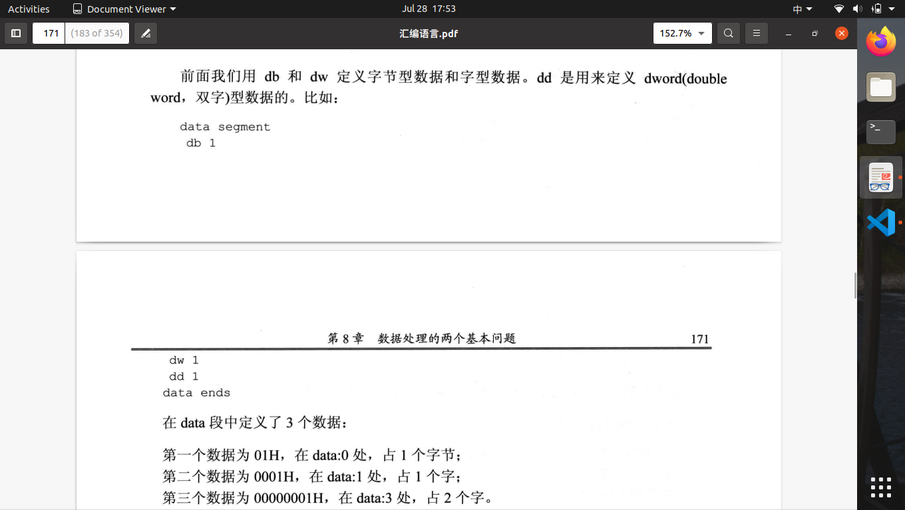
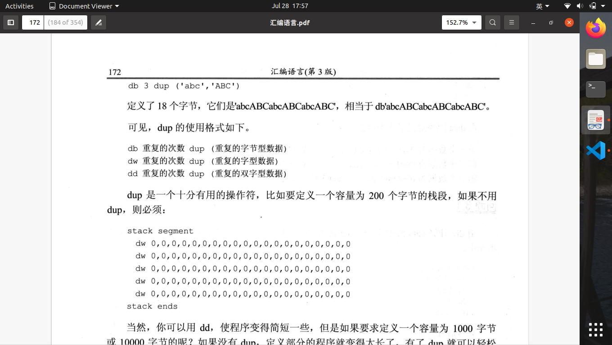

# 第八章 数据处理的两个基本问题

1.自定义两个描述符号：reg和sreg
2.reg寄存器:ax,bx,cx,dx,,sp,bp,si,di
3.sreg段寄存器:ds,ss,cs,es
4.bx,si,di,bp可用于内存单元寻址。例子:[bp]这四种寄存器除了单独出现，还能以组合方式出现bx和si，bx和di,bp和si,bp和di，[bx+bp],[si+di]为错误方法
5.[bx]段地址来自dx，[bp]来自ss
6.处理的数据可放在:CPU内部，内存，端口;数字（立即数）会直接存储在指令缓存器。

7.寻址方式：直接寻址，寄存器间接寻址等

8.db定义byte，dw定义word
9.数据尺寸指明方式：寄存器名指明数据尺寸；X ptr指明内存单元的长度可选word,byte；有些指令默认访问特定单元，如PUSH默认访问字单元。
10.[bx].idata[si]用bx定位结构体；idata定位数据项；si定位数据项中的每个元素。
11.div指令，被除数放在AX或DX和AX中。若除数为8位，则被除数16位放在AX中；若除数为16位，则被除数32位，高16位放在DX中，低16位放在AX中。
12.div指令结果:除数为8位，则AL存储商、AH存储余数；如果除数为16位，则AX存储商、DX存储余数。
13.div格式：

$$
    div reg\\
    div 内存单元\\
    div byte ptr ds:[0]
$$

14.div byte ptr ds:[0]的意思是(al)=(ax)/((ds)x16+0)的商，(ah)=(ax)/((ds)x16+0)的余数
15.伪指令dd用来定义dword(double word,双字)型数据的。

16.dup指令，用来进行数据的重复，常与db,dw,dd等数据定义进行配合使用。

17.将多维数字问题转换为数组问题，由相对基址变址寻址搜寻数据。
