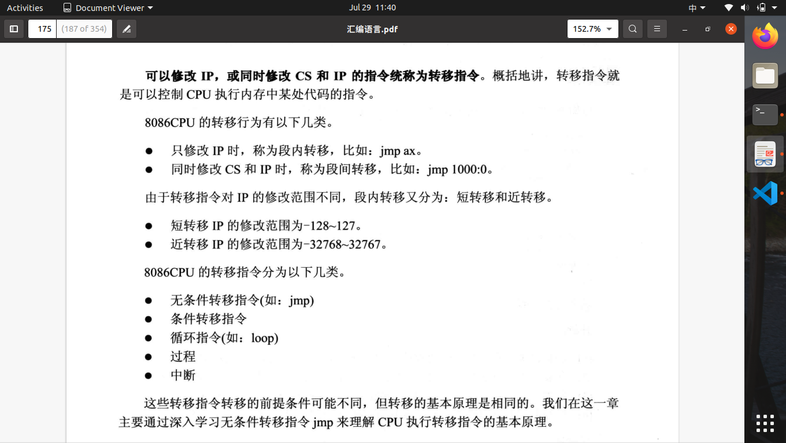
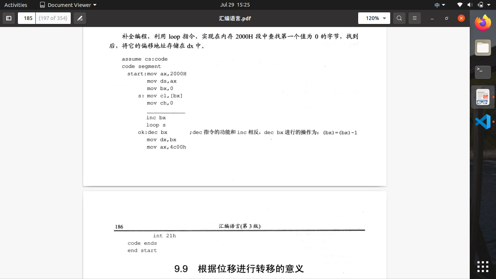
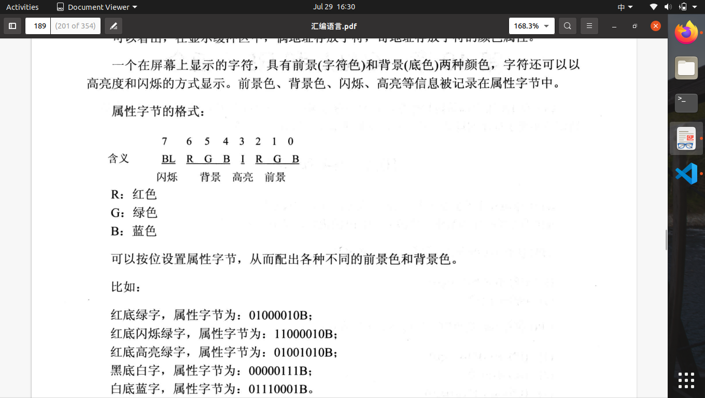

# 第9章 转移指令的原理

1.转移指令:可以修改IP，或同时修改CS或IP的指令。

2.操作符offset，由编译器处理的符号，功能是取得标号的偏移地址。
3.mov ax,offset start相当于指令mov ax,0
4.jmp指令为**无条件转移指令**，jmp指令要给出两种信息：转移的目的地址；转移的距离（段间转移，段内短转移，段内近转移。
5.**根据位移进行转移的jmp指令**：jmp short 标号（转到标号处执行指令）；short标识短转移（8位偏移），IP转移范围为:-128~127
6.jmp short s，实现的是段类短转移。在执行时，被解释为jmp+位移量。位移量以补码存储。此指令功能为：(IP)=(IP)+offset。offset为相对于jmp指令结尾后第一个字节的位移。例子：EB 03
7.jmp near ptr 标号,实现的是段内近转移。功能为：(ip)=(IP)+16位位移。例子：E8 03 21
8.**转移的目的地址在指令中的jmp指令**：jmp far ptr 标号。
9.jmp far ptr 标号，实现的是段间转移，又称为远转移。far ptr指明指令用标号的段地址和偏移地址修改CS，IP。例子：EB 03 21 05 56，则段地址位CS：5605H，IP：2103H（小段存储）。
10.**转移地址在寄存器中的jmp指令**：jmp 16位reg,功能：(IP)=(16位reg)
11.**转移地址在内存中的jmp指令**：jmp word ptr 内存单元地址(段内转移)，取得1个字为IP；jmp dword ptr 内存的单元地址(段间转移)，取得两个字即为CS：IP。
12.jcxz指令为**有条件转移指令**,所有的有条件转移指令都为短转移，机器码中包含位移。指令格式:jcxz 标号(如果(CX)=0,z转移到标号处执行。)位移=标号处地址-jcxz指令结尾地址后第一个字节的位移。功能相当于:if((cx)==0) jmp short 标号；
13.loop指令为循环指令，都为短转移指令。功能相当于：(cx)--;if((cx)$\neq$0) jmp short 标号
14.此空填inc cx，是为了防止第一个字节即为0，则cx=0,loop先进行cx-1得-1,则循环不会停止。对cx中的ch,cl分别赋值的原因为：防止ch有初始值（不为0）。

15.根据位移进行转移的意义：方便程序段在内存中浮动
16.编译会对转移位移进行超界检测。jmp 2000:1000只有在Debug中可以使用，汇编编译器对于此指令回报错。
17.内存地址空间中，B8000H～BFFFFH共32KB的空间，为80x25（25行，80个字符，每个字符可以有256个属性，即一个字符为16位ASCII码:属性）彩色字符模式的显示缓冲区。共8页，偶地址为字符，基地址为属性。前景（字符色），背景（底色）

