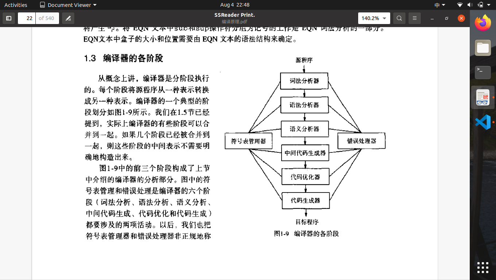
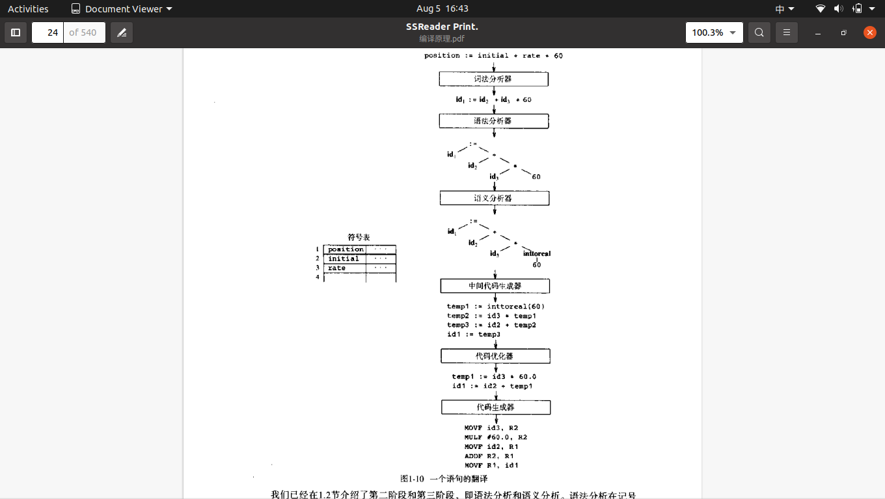
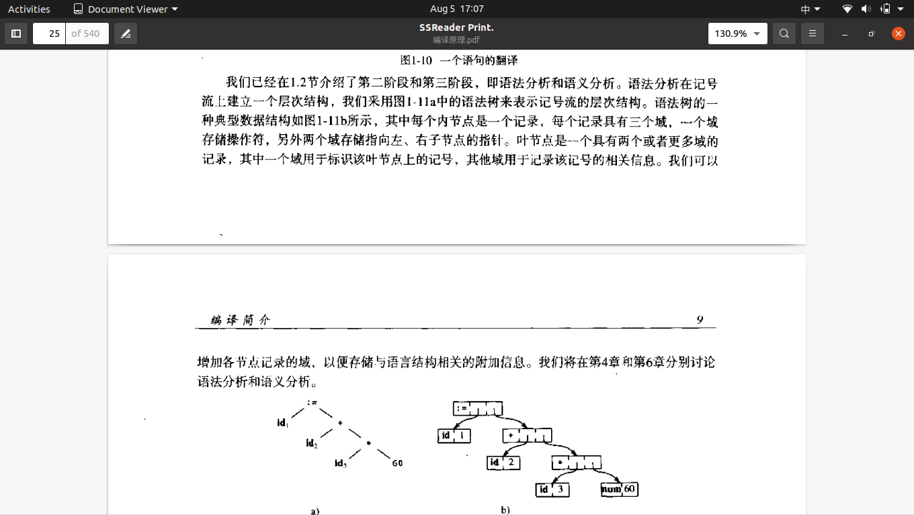

# 第一章 编译简介

1.编译器被分为:一遍编译器、多遍编译器、装入并执行编译器、调试编译器、优化编译器等。
2.编译器由两部分组成:分析与综合。分析部分将源程序切成一些基本块并形成源程序的中间表示，综合部分把源程序的中间表示转换为所需的目标程序。
3.预处理器:把存储在不同文件中的程序模块集成为一个完整的源程序。预处理器可以把源程序中称为宏的缩写语句展开为原始语句加入到源程序中。
4.源程序分析:线性分析,从左到右读字符流,把字符流分为多个记号,记号为具有整体含义的字符序列；层次分析，字符串或记号在层次上划分为具有一定层次的多个嵌套组；语义分析，确保程序各部分是有意义的组合在一起。
5.线性分析：又称**词法分析**或扫描。例子：position := initial + rate*60,

> + 标识符postion
> + 赋值符:=
> + 标识符initial
> + 加号+
> + 标识符rate
> + 乘号*
> + 数字60

6.层次分析：又称语法分析。对源程序记号进一步分组，产生被编译器用于生成代码的语法短语。
有几点规则：

> 1.任何一个标识符都是表达式；
> 2.任何一个数都是表达式；
> 3.如果expression1和expression2是表达式,expression1+expression2也是表达式；
> 4.如果identifier1是一个标识符，expression2是一个表达式，则identifier1:= expression2是一个语句；
> 5.如果expression1是一个表达式，statement2是一个语句，则while(expression1) do statement2 if(expression1) then statement2 也是语句。

7.语义分析:检测源程序的语义错误,并收集代码生成阶段要用的类型信息。语义分析利用语法分析阶段确定的层次结构来识别表达式和语句中的操作符和操作数。语义分析的一个重要组成部分为类型检查。

8.符号表是一种数据结构。每个标识符在符号表中都有一条记录，记录的每个域对应于该标识符的一个属性。形成一个记号的字符序列称为该记号的词素。

9.语法树有一种典型的数据结构，其中每个内节点是一个记录，每个记录具有三个域，一个域存储操作符，另外两个域存储指向左右子节点的指针。叶节点是一个具有两个或者更多域的记录，其中一个域用于标识该叶节点上的记号，其他域用于记录该记号的相关信息。

10.中间代码生成：源代码的中间表示应该具有两个性质：一是易于产生，二是易于翻译成目标程序。
11.代码优化：改进中间代码，以产生执行速度较快的机器代码。
12.代码生成：生成可重定位的机器代码或汇编代码。此阶段，编译器为源程序定义和使用的变量选择存储单元，并把中间指令翻译成完成相同任务的机器代码指令序列。这一个阶段的关键问题是变量的寄存器分配。
13.预处理器：产生编译的输入，一般具有以下功能：

> 1.宏处理。预处理器允许在源程序中定义宏，宏是被经常使用的较长结构的缩写。
> 2.文件包含。预编译器可以把头文件包含到程序正文中。例如：C语言的预处理器能够用<math.h>文件的内容代替源程序中的语句# include<math.h>。
> 3.“理性”预处理器。这些处理器能把现代控制流和数据结构化机制添加到比较老式的语言中。例如，如果一种语言没有while语句和if语句这样的控制结构，理性处理器可以用内部宏定义向用户提供这类控制结构。这类处理器通过大量的内部宏定义来增强语言的能力。

14.宏处理器处理两种类型的语句：宏定义和宏引用。宏定义由具有惟一性的字符或者关键字来标识，如define或macro。宏定义包括被定义的宏的名字和构成其定义的体。通常，宏处理器允许宏定义中包含形式参数，即被值替代的符号。宏的引用只需要提供宏名和实在参数。实在参数是形式参数的值。
15.最简单的汇编器对输入汇编源程序文件进行两遍扫描，每遍读入文件一次。在第一次扫描时，将表示存储单元的所有标识符都被识别出来并存入符号表（此符号表与编译器符号表不同）；第二遍扫描，将每个操作符翻译成机器语言中代表相应操作的二进制位序列，将代表存储单元的每个标识符翻译成符号表中该标识符的地址。
16.loader完成程序的装入和连接编辑两项功能。装入过程包括读入可重定位机器代码，修改可重定位地址，并将修改后的指令和数据放到内存中适当的位置。
17.连接编辑器将多个可重定位机器代码的文件组装成一个程序。
18.读完第一章的感受是：文字过多，翻译太硬了，读起来有点乏力。
